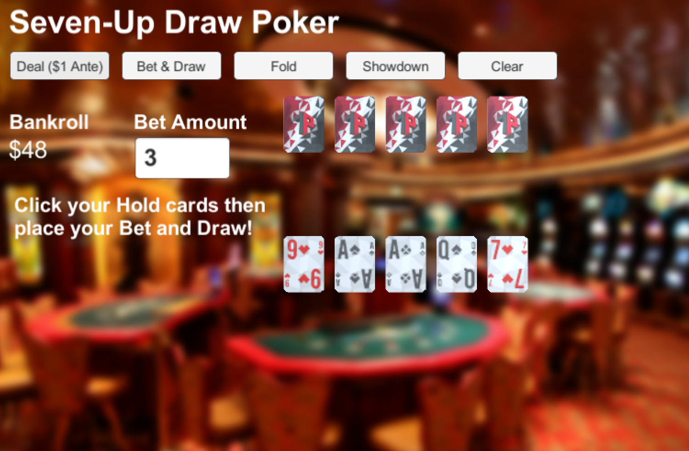

# SevenUpDrawPoker

Draw Poker with limited Seven-Up deck. Implemented in Unity with C#  
  
Traditional Seven-Up Poker (also known as Manila Poker) is a Poker derivative played with a 32-card deck and community cards. Cards ranked lower than 7 are not included in the deck so higher-ranked hands occur more often. Flush is harder to achive so it gets a higher rank than Full House.  
  
I call this poker variant Seven-Up Draw Poker because it uses the restricted 32-card deck and hand rankings of Seven-Up but plays like Draw Poker (no community cards). I allow the Ace-Low straight as a valid straight (A, 7, 8, 9, 10).  
  
This is a 1-player game with an AI dealer opponent. There is one opportunity to bet, after the deal. Choose 0-5 cards you want to keep and a bet amount then click Draw to replace your discarded cards and make your final hand.  
  
The core Poker gameplay works and the package has an Apache license so you can extend it for your own games. Please contact me if you use it or discover any problems:   
info@roguish.com   
  
Seven-Up Poker description:  
http://www.poker.com/game/holdem-poker-games/manila.htm  
  
Playing Card art and models used with permission of 1Poly:   
https://www.assetstore.unity3d.com/en/#!/content/51076  
  
Casino Image attribution:  
https://www.flickr.com/photos/prayitnophotography/15979274301  
  
Finite State Machine based on work of Jackson Dunstan and Prime31's StateKit:   
https://github.com/ElliotMebane/UnityFiniteStateMachine  
  
Tween Engine by Prime31: https://github.com/prime31/ZestKit   
  
Licensed under the Apache License, Version 2.0
